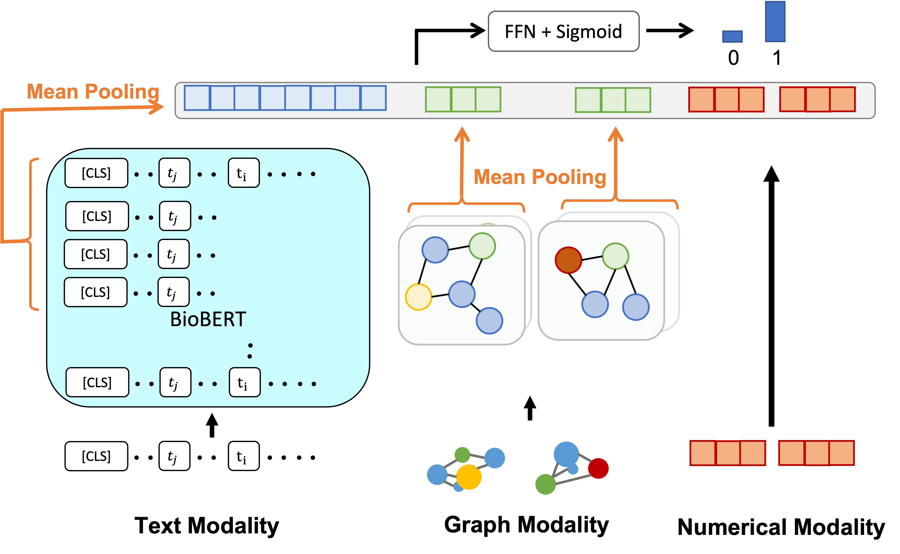

<div align="center">

# Protein-protein Interaction Prediction Utilizing Multi-modal Information

<a href="https://pytorch.org/get-started/locally/"></a>
<a href="https://pytorchlightning.ai/"></a>
<a href="https://hydra.cc/"></a>
<a href="https://github.com/ashleve/lightning-hydra-template"></a><br>

</div>

## Description
Predict protein-protein interaction (PPI) utilizing multi-modality, including text, molecular structure (*Graph*), and numerical feature.
Transformer-based models and graph neural networks are dedicated for text and graph, respectively.\
Core idea comes from [Multimodal Graph-based Transformer Framework for Biomedical Relation Extraction](https://aclanthology.org/2021.findings-acl.328/).\
Our's differs in that our model for protein structural modality process over residues rather than atoms.




## Results
We list the Precision/Recall/F1 scores of each models in the following table.

| Model | HPRD50 | BioInfer |
| :--- | ---: |---: |
| Dutta et al. [1] (Text) | 90.44/58.67/71.17 | 54.42/87.45/67.09 |
| Dutta et al. [1] (Text & Graph) | 94.79/75.21/83.87 | 69.04/88.49/77.54 |
| Pingali et al. [2] &dagger; | 95.47/94.69/95.06 | 78.49/79.78/80.86 |
| Text only | -/-/- | -/-/- |
| Graph only | -/-/- | -/-/- |
| Numerical only | -/-/- | -/-/- |
| Text + Graph | -/-/- | -/-/- |
| Text + Numerical | -/-/- | -/-/- |
| Graph + Numerical | -/-/- | -/-/- |
| Text + Graph + Numerical | -/-/- | -/-/- |

&dagger;: The evaluation metrics in the author's implementation seem broken, though. Their text modality model is too simple yet has beaten previous models, including strong pretrained model-based, Bio-BERT-based one. Moreover, we found bugs in their implementation of metrics.

> [1]: Pratik Dutta and Sriparna Saha, Amalgamation of protein sequence, structure and textual information for improving protein-protein interaction identification, In Proceedings of the 58th Annual Meet- ing of the Association for Computational Linguistics\
> [2] Sriram Pingali, Shweta Yadav, Pratik Dutta and Sriparna Saha, Multimodal Graph-based Transformer Framework for Biomedical Relation Extraction, Findings of the Association for Computational Linguistics: ACL-IJCNLP

## Requirements
Dependency is maintained by poetry. Some dependencies (ones related to pytorch-geometric), however, can not be installed via poetry and need to be installed manually.
Please follow [instructions](https://github.com/pyg-team/pytorch_geometric#installation).
We used libraries compatible with pytorch 1.10.0.
```console
$ CUDA=cu102  # cpu, cu102, or cu113
$ pip install torch-scatter -f https://data.pyg.org/whl/torch-1.10.0+${CUDA}.html
$ pip install torch-sparse -f https://data.pyg.org/whl/torch-1.10.0+${CUDA}.html
$ pip install torch-geometric
```

## Preprocess
1. Download PPI data annotated with gene names from [here](https://github.com/duttaprat/MM_PPI_NLP) to data/mm_data.
2. Convert xlsm file to csv file (suppose `HPRD50_multimodal_dataset.csv`).
3. List up gene names in `HPRD50_multimodal_dataset.csv` by `preprocess/list_gene_names.py`. (You need specify dataset name)
4. Fetch pdb ids and ensemble ids corresponding to gene names by `preprocess/fetch_pdb_ensemble_id.py`.
5. Fetch pdb files corresponding to pdb ids by `preprocess/fetch_pdb_by_id.py`.
6. Complement pdb id by `preprocess/complement_pdb_id.py`.

```console
$ python preprocess/list_gene_names.py data/mm_data/HPRD50_multimodal_dataset.csv  data/mm_data/hprd50_gene_name.txt
$ python preprocess/fetch_pdb_ensemble_id.py data/mm_data/hprd50_gene_name.txt data/mm_data/genename2emsembl_pdb.json [hprd/bioinfer]
$ python preprocess/fetch_pdb_by_id.py data/mm_data/genename2emsembl_pdb.json data/pdb
$ python preprocess/complement_pdb_id.py data/mm_data/HPRD50_multimodal_dataset.csv data/[hprd/bioinfer]/all.csv data/mm_data/genename2emsebl_pdb.json
```

NOTE: Resultant csv file should be located at **data/[hprd/bioinfer]/all.csv**

The PDB files are translated into graphs on the fly.
The result will be cached in the directory specified by *CACHE_ROOT* environment variable because processing takes a little time.
You may set it by .env file (see .env.example).


## How to run

The method is evaluated based on 5-fold cross validation (you may change the number of folds).
If needed, you may modify configuration in `configs/train.yaml` and its dependents.
```console
# default
$ python run.py

# train on CPU
$ python run.py trainer.gpus=0

# train on GPU
$ python run.py trainer.gpus=1
```

You may run all configure combination by make command.
```console
# Run all combination
$ make all DATASET=hprd

# Run text model
$ make text DATASET=hprd
```
You can override any parameter from command line like this
```console
$ python run.py trainer.max_epochs=20 datamodule.batch_size=64
```

All results are maintained by mlflow. You can launch mlflow server by `mlflow ui`.
```console
$ mlflow ui
```


## Hyper Parameters
Hyper parameters are listed in model configuration file as well. For more detail, you may refer to it.

| Option | Values|
| :--- | ---: |
| Optimizer | AdamW |
| batch size | 32 |
| Maximum epochs | 20 |
| Learning scheduler | Linear scheduler |
| Learning rate | 5e-5 |
| Warmup Epoch | 5 |
| Weight Decay | 0.01 |
| Node dimension of GNN | 128 |
| The number of GNN layers | 2 |
| Dimension of numerical feature | 180 |
